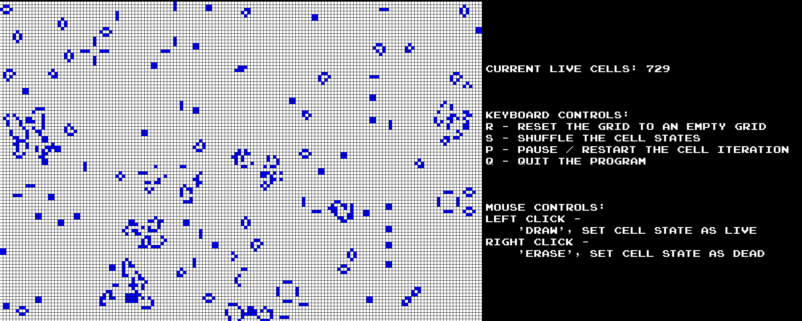

# CS6010 Final Project

> [Conway's Game of Life](https://en.wikipedia.org/wiki/Conway%27s_Game_of_Life)

Here is a demo screenshot of the game:


## Group Member
- Rason Hung
- Lydia Yuan

## How to run the game

### For Xcode dev
⚠️ Please comment the section for tests in `CMakeLists.txt` first!
```shell
mkdir xcode
cd xcode
cmake -G Xcode ..
open finalProject.xcodeproj
# open the project in XCode
```

### For VS Code dev
```shell
mkdir build
cd build
cmake ..
make
./finalProject
```

## How to run the tests


### For Xcode dev
```shell
mkdir xcode
cd xcode
cmake -G Xcode ..
open finalProjectTests.xcodeproj
# open the project in XCode
```

### For VS Code dev
```shell
mkdir build
cd build
cmake ..
make
./finalProjectTests
```

## Rules
- Any live cell with fewer than two live neighbours dies, as if by underpopulation
- Any live cell with two or three live neighbors lives on to the next generation
- Any live cell with more than three live neighbors dies, as if by overpopulation
- Any dead cell with exactly three live neighbors becomes a live cell, as if by reproduction

## How the program iterates at almost constant rate

```c++
// main.cpp

setInterval(computeNextIterationLambdaFunction, interval, cancel);
```
In the `setInterval` function, we blocks the execution of the current thread until specified `sleep_time` ( current time + interval ) has been reached, then we call the function passed into the `setInterval`

It works like the `setInterval` in JavaScript

## Optimization

### In-place cell states iteration

```c++
// we set four cell states
enum State
{
    live = 1,
    dead = 0,
    nextIterationLive = 2,
    nextIterationDead = -1
};
```

When we compute the cell states of the next iteration, to avoid creating a new `Grid` to store the current computation result and keep the original states in the current grid, we flip `live` to `nextIterationDead`.

`live` and `nextIterationDead` both count as "currently live".

So we could get the final cell state after traversing through the grid ( `live` still remains live, but `nextIterationDead` will be changed to `dead` )

## Program Structure

```
.
├── CMakeLists.txt
├── DemoScreenshot.png
├── README.md
├── build
│   ├── CMakeCache.txt
│   ├── CMakeFiles
│   ├── Makefile
│   ├── cmake_install.cmake
│   ├── finalProject
│   └── finalProjectTests
├── src
│   ├── components
│   ├── main.cpp
│   ├── tests.cpp
│   └── utils
└── xcode
    ├── CMakeCache.txt
    ├── CMakeFiles
    ├── CMakeScripts
    ├── cmake_install.cmake
    └── finalProject(Tests).xcodeproj
```